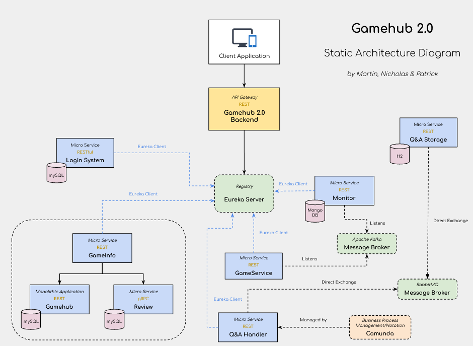
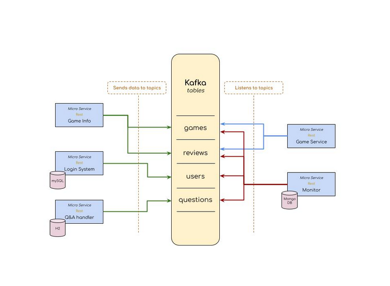
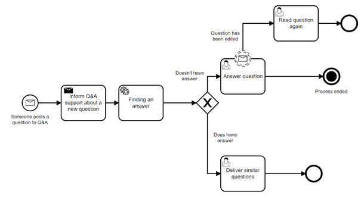
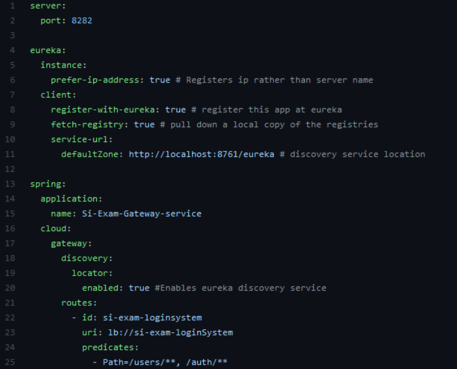

#System Integration 2021 - Exam Project

**By:**
* Martin Seest Holmqvist
* Nicholas Mathias Tureczek
* Patrick Picard Jønsson

# LINK TO VIDEO
[Video Presentation](https://www.youtube.com/watch?v=-hWtQyDn41w&ab_channel=MartinHolmqvist)

## Table of Contents
- [LINK TO VIDEO](#Introduction to our solution)
    * [Introduction to our solution](#Introduction to our solution)
    * [Kafka](#Kafka)
- [Architecture](#architecture)
    * [Technologies](#technologies)
        + [Overview of the different services](#Overview of the different services)
        + [Chosen technologies](#Chosen technologies)
        + [GameHub - Monolithic/Legacy Application](#GameHub-Monolithic/Legacy Application)
        + [Aggregation](#Aggregation)
        + [Camunda](#Camunda)
        + [Eureka](#Eureka)
        + [Gamehub 2.0 Backend - Gateway](#Gamehub 2.0 Backend Gateway)
        + [Login System](#Login System)

##Introduction to our solution
###Static Architecture diagram
The following image presents a Static Architecture Diagram of our application.
The diagram below shows the connection between our services, and how they are managed through the Eureka Server.
It does not show all our connections in kafka, this will be shown in a diagram in the next section.

###Kafka
The system is sending a lot of messages back and forth between our services, and we choose kafka as our primary message broker both to send and receive messages between our services.\
Below is a diagram of our kafka broker which shows our services and which services are sender of data, and which is listening for the data send through kafka

As it is shown in the diagram above, we want to point out that the “Monitor” service is listening on all topics. This is because we want to be able to know what's going on at all times. If a user is created we send this information to the Monitor service, likewise with games reviews and questions. This way we can monitor our application and keep ourselves ajour with what's going on.
This is also why we have chosen noSQL - MongoDB as our database for this service.
MongoDB is a document database and it accepts all kinds of entries, which makes it easier for us to store that information here, as we don’t have to know precisely what goes into the database while we can create our tables as we go.

##Overview of the different services:

|     Application     	| Port  	| Name                 	|
|:-------------------:	|-------	|----------------------	|
| Eureka Server       	| 8761  	| SI-Exam-EurekaServer 	|
| Gamehub             	| 8083  	| SI-Exam-Gamehub      	|
| Gamehub 2.0 Gateway 	| 80    	|                      	|
| GameInfo            	| 8082  	| SI-Exam-GameInfo     	|
| GameService         	| 8085  	| SI-Exam-GameService  	|
| Kafka Server        	| 9092  	| -                    	|
| Login System / User 	| 8081  	| SI-Exam-LoginSystem  	|
| Monitor             	| 8086  	| SI-Exam-Monitor      	|
| Q&A Handler         	| 8087  	| SI-Exam-QAHandler    	|
| Q&A Storage         	| 8088  	| SI-Exam-QAStorage    	|
| RabbitMQ Server     	| 15672 	|                      	|
| Review Extension    	| 8084  	| SI-Exam-Review       	|

##Chosen technologies

|    Technology   	|                                                                                                                                                                                  Usage                                                                                                                                                                                  	|
|:---------------:	|:-----------------------------------------------------------------------------------------------------------------------------------------------------------------------------------------------------------------------------------------------------------------------------------------------------------------------------------------------------------------------:	|
|     Camunda     	| Is used to make workflow and decision models in the use case of writing a question to our Q&A Service.                                                                                                                                                                                                                                                                  	|
|     Compass     	| MongoDB desktop application which we use to get a look into the tables of our MongoDB database.                                                                                                                                                                                                                                                                         	|
|       gRPC      	| In the review application we are using gRPC for sending data, because gRPC is fast and neat, and allows us to get an insight into the functions that we can use from the server, because of the creation of a stub from the protobuf file. This ensures that we don’t make wrong calls to the server, like it could happen with REST because of the use of json format. 	|
|   H2 database   	| In some of the applications we are using a H2 database, which won't persist the data. The reason why we are using this type of SQL database, is that the usage of it is with data from other databases, which doesn’t need to be persisted. And then it’s pretty easy to set up.                                                                                        	|
|  IntelliJ IDEA  	| Java development environment                                                                                                                                                                                                                                                                                                                                            	|
|      Kafka      	| Used as a message broker between many of our services. We have presented an overview diagram of our Kafka system in this README                                                                                                                                                                                                                                         	|
|     MongoDB     	| We are using MongoDB to store data coming from different applications, in the monitoring application. The reason why we are using a NoSQL Database, is because it's easy to use and change, without the need of altering different tables like a SQL database.                                                                                                          	|
|      MySQL      	| We’re primarily using a MySQL database to persist data, in the services which need persistent data. We chose MySQL because this has been the primary SQL database we have used throughout our Computer Science education.                                                                                                                                               	|
| MySQL Workbench 	| MySQL Desktop application                                                                                                                                                                                                                                                                                                                                               	|
|  Netflix Eureka 	| Used as our Microservice register, keeping tabs on our different services, and how to reach them.                                                                                                                                                                                                                                                                       	|
|     Postman     	| Used to verify the API requests and response throughout the system. Additionally it is used to start the camunda flow.                                                                                                                                                                                                                                                  	|
|     RabbitMQ    	| Message broker between Q&A handler and Q&A Storage                                                                                                                                                                                                                                                                                                                      	|
|     RESTful     	| We have used RESTful in our login service.                                                                                                                                                                                                                                                                                                                              	|

##GameHub - Monolithic/Legacy Application

Gamehub is our monolithic application which has been built in Node.Js.
The main application is a website for reviewing and reading information about games, where a user is able to write his/her own review on a specific game, which then will be added to the overall reviews of said game, along with the score given by the user. The website will then accumulate the newly added user score with the overall score of the game, and adjust the total score of the game.
In the application it is possible for an admin to make CRUD operations on games and users.

##Aggregation

_“Aggregation (also known as **containment) is a specialized form of association. It defines a one-way relationship that specifies a 'has-a' relationship between two classes.”_

In our program we have designed an aggregated root “GameInfo” which has a connection between our legacy system “Gamehub” and a newly designed service “Review Extension”.
The general idea here is that the review application should replace the model in the legacy system.
We wanted to create the new review service so that it is able to create CRUD operations through gRPC whereas the legacy system is transferring all the data through JSON. The reason for choosing gRPC as the way to send data, is because it is more lightweight to send while it sends in binary codes and not strings. This decision also makes sure we won’t have problems with integrating other code languages to this service because gRPC is language independent
We have also attached a separate mySQL database to “Review Extension” which makes it easier to scale, manage and maintain in the future.

##Camunda

Camunda is in the project being used as a Q&A Service, where a user can send a question through Camundas rest endpoint at “http://localhost:8087/engine-rest/message”.
The question is send as a JSON object, containing:

    {
        "messageName" : "QuestionPosted",
        "businessKey" : "1",
        "processVariables" : {
        "question" : {
                    "value" : "This is a question posted to Q&A",
                    "type" : "String"
                    }
      }
    }

The messageName key is the process that starts the camunda flow. Inside the ProcessVariables, we have the question itself from the user. This question is being sent by our java backend via RabbitMQ through “direct-exchange” to our QAStorage service.
In our QAStorage service, we receive the question from the user, transmitted via RabbitMQ, and search through our H2 Database to see if we have any similar questions containing potential answers to the problem.
If the case is that the H2 database contains one or more similar questions to the one received by the user. We sent the answer(s) back via RabbitMQ in “direct exchange” to the QAStorage service, and delivered the answers to the customers.

If no answer is found in the database, the QAStorage is gonna send a message back to the QAStorage service, informing that no answers were found.
In that case, Camunda is going to send the flow to a user task, demanding that an admin is going to answer the question posted by the user, before the flow is completed.
Additionally, we are going to have a timer set on 24 hours by the user task, that sends a reminder to the admin to answer the question of the user.

##Eureka
Netflix Eureka is our application that holds the information about all client-server applications.
All the microservices in this application are registered  into our Eureka server and then our Eureka server knows which port our individual service is running on.

As shown above, we can access this information from our Eureka server, by going to our browser http://localhost:8761/ where we can get an overview of all the servers running, the names and on what port these services are running.

##Gamehub 2.0 Backend - Gateway
This is the gateway for our application, which holds no logic in it. The only function our Gateway has, is to know about the other services via the id, uri and the predicates.

The above example shows the application.yml file attached to our gateway.
The interesting part in this piece of code, is happening from line 21 where we notate the route, in this route we set the id to refer to the project as ‘SI-Exam-LoginSystem’. 
After that we set the uri to be “lb://si-exam-loginSystem”.  It is also necessary to notate the predicates, which is used to tell the endpoints of the application. 
On line 25 we notate the “path=/user/**, /auth/**” this tells our gateway that it should use these endpoints when calling the login system.

#Login System

The user application handles the authentication of users using bcrypt for hashing the passwords.

The application is using restFull and has 2 RequestMapping that is used to map web requests onto specific handler classes and methods.

    @RequestMapping("/auth/")
    @RequestMapping("/user/")

###BCrypt

As previously stated we have are hashing the passwords with bcrypt library.\
Bcrypt is a password-hashing function based on the blowfish algorithm.

An example of a Bcrypt hash that can be stored in a db is as followed[1](#f1):

    $2a$10$N9qo8uLOickgx2ZMRZoMyeIjZAgcfl7p92ldGxad68LJZdL17lhWy
    \__/\/ \____________________/\_____________________________/
    Alg Cost      Salt                        Hash

Alg: The hash algorithm identifier for bcrypt\
Cost: Cost factor (2^10 i.e. 1,024 rounds)\
Salt: 16-byte (128-bit) salt using Radix-64(binary to text) encoding\
Hash: 24-byte (192-bit) hash, Radix-64 encoded

In our application we are hasing with a cost of 10. This is done due to speed and not security.

A chart showing cost vs time[2](#f2)

    bcrypt | cost: 10, time to hash: 65.683ms
    bcrypt | cost: 15, time to hash: 2043.034ms
    bcrypt | cost: 20, time to hash: 66779.182ms

<b id="f1">1</b> https://en.wikipedia.org/wiki/Bcrypt#Expensive_key_setup \
<b id="f2">2</b> https://auth0.com/blog/hashing-in-action-understanding-bcrypt/ 

